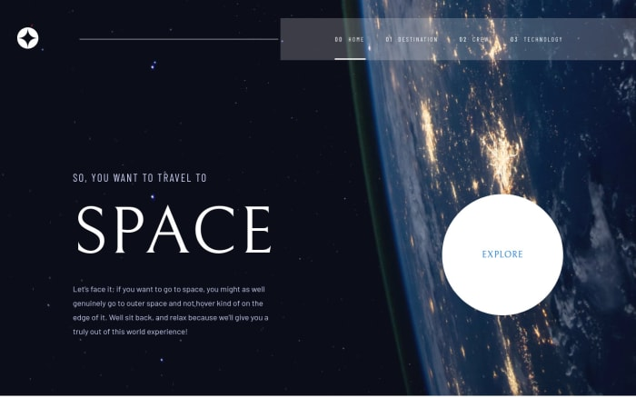

# Frontend Mentor - Space tourism website solution

This is a solution to the [Space tourism website challenge on Frontend Mentor](https://www.frontendmentor.io/challenges/space-tourism-multipage-website-gRWj1URZ3). Frontend Mentor challenges help you improve your coding skills by building realistic projects.

## Table of contents

-  [Overview](#overview)
   -  [The challenge](#the-challenge)
   -  [Screenshot](#screenshot)
   -  [Links](#links)
-  [My process](#my-process)
   -  [Built with](#built-with)
   -  [What I learned](#what-i-learned)
   -  [Continued development](#continued-development)
   -  [Useful resources](#useful-resources)
-  [Author](#author)

## Overview

### The challenge

Users should be able to:

-  View the optimal layout for each of the website's pages depending on their device's screen size
-  See hover states for all interactive elements on the page
-  View each page and be able to toggle between the tabs to see new information

### Screenshot

### Links

-  Solution URL: [Add solution URL here](https://github.com/jibreel1/space-tourism-app)
-  Live Site URL: [Add live site URL here](https://space-travel-app.netlify.app/)

## My process

### Built with

-  Semantic HTML5 markup
-  CSS custom properties
-  Flexbox
-  SCSS as a preprocessor
-  Mobile-first workflow
-  [React](https://reactjs.org/) - JS library

### What I learned

In this project, I learnt the basic concept of React and React Router.

### Continued development

I want to focus more on React because I find it very easy to use

### Useful resources

-  [w3schools](https://www.w3schools.com) - This website really helped me as a beginner. I have really improved, thanks to them.

-  [MDN](developer.mozilla.org) - This website really helped improve my React.

## Author

-  Frontend Mentor - [@jibreel1](https://www.frontendmentor.io/profile/jibreel1)
-  Twitter - [@jibreel1005](https://www.twitter.com/jibreel1005)
